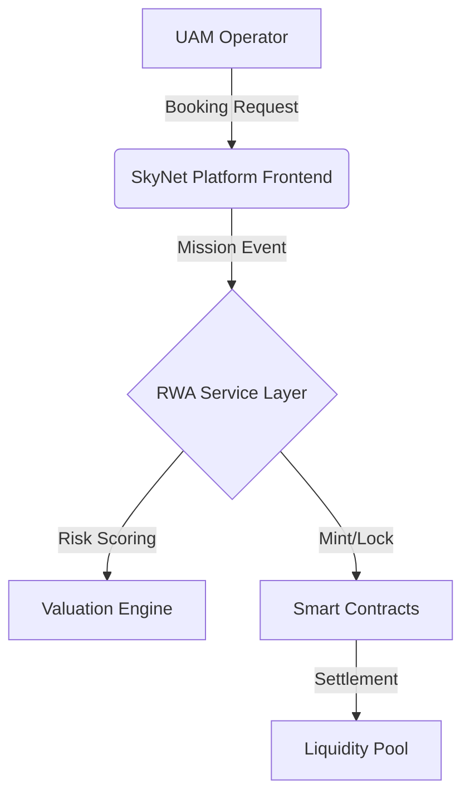

# SkyNetUAM-RWA: Tokenizing Low-Altitude Urban Air Mobility Operations

[](https://opensource.org/licenses/Apache-2.0)
[](https://doi.org/)
[]()

> **Official Implementation** of the paper: *"SkyNetUAM-RWA: Tokenizing Low-Altitude Urban Air Mobility Operations as Real-World Assets"* (Under Review, 2025).

## 📖 Overview

**SkyNetUAM-RWA** is a cyber-physical financial framework designed to bridge the "Assetization Gap" in the low-altitude economy. By integrating a high-fidelity UAM operational platform with an RWA (Real-World Asset) tokenization layer, this system enables the real-time transformation of flight missions, service packages, and airspace slots into collateralizable financial instruments.

### Key Features
*   **Cyber-Physical Operational Layer**: A modular microservices architecture (Node.js/NestJS) for handling high-frequency telemetry and mission control.
*   **Dynamic Risk Valuation**: Implements a stochastic DCF model with real-time environmental risk adjustment ($\rho_{env}$).
*   **Smart Contract FSM**: A Finite State Machine governing the token lifecycle from `Pending` $\to$ `Active` $\to$ `Locked` $\to$ `Settled`.
*   **Hybrid Ledger Support**: Compatible with Local Emulation (Hardhat) and Public Testnets (Sepolia, Polygon Amoy).

## 🏗️ System Architecture

The system follows a **Domain-Driven Design (DDD)** approach, separating the operational core from the financial settlement layer.



## 🚀 Getting Started

### Prerequisites
*   Node.js v18+
*   Docker & Docker Compose
*   Ethereum Wallet (MetaMask) or Local Node (Hardhat)

### Installation

1.  **Clone the repository**
    ```bash
    git clone https://github.com/liuyushugreat/SkyNetUamPlatformV1.git
    cd SkyNetUamPlatformV1
    ```

2.  **Install dependencies**
    ```bash
    # Install backend dependencies
    cd backend && npm install
    
    # Install frontend dependencies
    cd ../frontend && npm install
    ```

3.  **Configure Environment**
    Copy `.env.example` to `.env` and set your RPC endpoints and private keys.
    ```bash
    cp .env.example .env
    ```

4.  **Run the Simulation**
    ```bash
    npm run start:dev
    ```

## 🧪 Experiments & Reproduction

To reproduce the experimental results (Figure 6, 7, 8) presented in the paper:

1.  **Run the Traffic Generator**
    ```bash
    python3 scripts/generate_traffic.py --rate 1000 --dist lognormal
    ```

2.  **Execute Benchmarks**
    ```bash
    npm run benchmark:throughput
    ```

3.  **Generate Plots**
    ```bash
    python3 generate_figures.py
    ```

## 📚 Citation

If you use this code or framework in your research, please cite our paper:

```bibtex
@article{Liu2025SkyNetUAM,
  title={SkyNetUAM-RWA: Tokenizing Low-Altitude Urban Air Mobility Operations as Real-World Assets},
  author={Liu, Yushu and Wang, Longbiao and Du, Chenglin and Zhai, Haixiao},
  journal={arXiv preprint arXiv:25XX.XXXXX},
  year={2025}
}
```

## 📄 License

This project is licensed under the Apache License 2.0 - see the [LICENSE](LICENSE) file for details.

---
*Developed by the SkyNet Research Team.*
