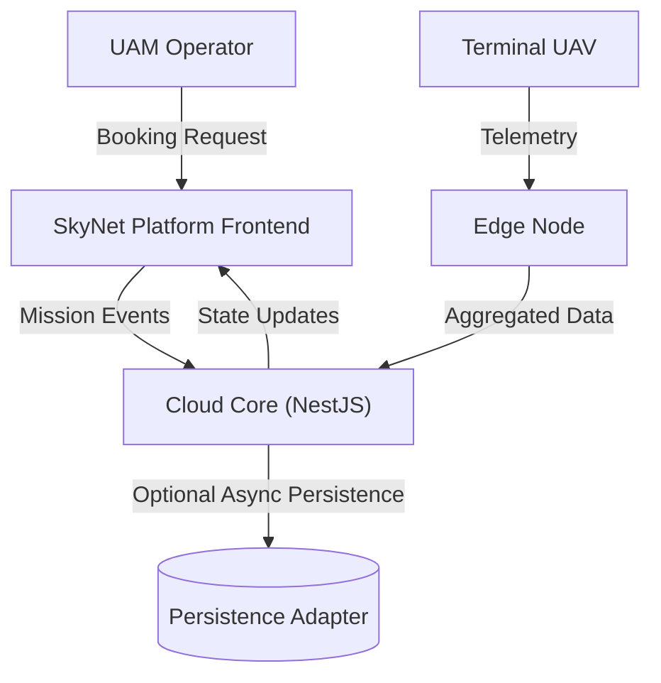

# SkyNetUAM: Lifecycle-Aware Low-Altitude UAM Operations Platform

[](https://opensource.org/licenses/Apache-2.0)
[](https://doi.org/)
[]()
[](https://www.python.org/downloads/)
[](https://pytorch.org/)

> **Official implementation** of our Drones submission (2025): a mission-lifecycle-aware operational platform for scalable low-altitude UAM/drone operations.  
> Note: on-chain components are treated as an **optional audit/settlement extension** and do not change the core operational logic.

## 📖 Overview

**SkyNetUAM** is a lifecycle-aware operations platform for low-altitude UAM/drone missions. It models missions as first-class operational entities (Created → Scheduled → Active → Completed/Failed/Delayed), enabling consistent state propagation across scheduling, monitoring, reporting, and (optionally) durable state persistence for audit/settlement.

### Key Features
*   **Mission lifecycle management**: deterministic state machine with event-driven transitions and timestamped records.
*   **Operational dashboards (frontend demo)**: citizen booking, operator monitoring, and regulator oversight views.
*   **Operational State Service (backend)**: NestJS service that ingests mission events and maintains consistent lifecycle state.
*   **Optional persistence adapter**: can be enabled as an asynchronous extension for auditability/settlement-style workflows (kept out of the critical operational path).
*   **SkyFlow conflict detection** *(NEW)*: Temporal Relational Graph Attention Network (TR-GAT) for real-time multi-UAV conflict detection in dense low-altitude airspace — see [modules/SkyFlow](./modules/SkyFlow).

## 🏗️ System Architecture

The system is designed around a **Cloud-Edge-End** architecture as described in the "System Architecture" section of the paper, ensuring scalable and low-latency operations for UAM missions.

### Architecture Mapping

*   **`/cloud-core` (Cloud Layer)**: Hosts the **Operational State Service** (NestJS). Responsible for global management, mission scheduling, and state persistence.
*   **`/edge-node` (Edge Layer)**: Handles localized computing and storage logic (simulating DGX/GP Spark interaction). Features a high-performance storage engine interface.
*   **`/terminal-uav` (End/Terminal Layer)**: Simulates UAV data collection and telemetry generation.

This hierarchical design allows for:
1.  **Global Consistency**: Maintained by the cloud core.
2.  **Low Latency**: Achieved by edge processing.
3.  **Real-time Data**: Ingested from the terminal layer.


```mermaid
graph TD;
  A[UAM Operator] -->|Booking Request| B[SkyNet Platform Frontend];
  B -->|Mission Events| C["Cloud Core (NestJS)"];
  C -->|State Updates| B;
  C -->|Optional Async Persistence| D[(Persistence Adapter)];
  E[Terminal UAV] -->|Telemetry| F[Edge Node];
  F -->|Aggregated Data| C;
```

## 🚀 Getting Started

### Prerequisites
*   Node.js v18+
*   (Optional) Python 3.10+ for reproducible experiments

### Installation

1.  **Clone the repository**
    ```bash
    git clone https://github.com/liuyushugreat/SkyNetUamPlatform.git
    cd SkyNetUamPlatform
    ```

2.  **Install dependencies**
    ```bash
    npm install
    cd cloud-core && npm install
    ```

3.  **Run the backend Operational State Service (optional but recommended)**
    ```bash
    cd cloud-core
    npm run dev
    ```

4.  **Run the frontend**
    ```bash
    cd ..
    npm run dev
    ```

## 🛩️ SkyFlow: Temporal Knowledge Graph Reasoning for Multi-UAV Conflict Detection

**SkyFlow** ([`modules/SkyFlow`](./modules/SkyFlow)) is a self-contained research module that implements **TR-GAT** (Temporal Relational Graph Attention Network) for anticipatory conflict detection in dense low-altitude urban airspace. It models airspace dynamics as an evolving **Temporal Knowledge Graph (TKG)** and performs multi-hop relational reasoning over UAV trajectories, flight intents, and environmental constraints.

### Architecture

```
ADS-B Telemetry ─┐
Flight Plans ────┤
Weather Grid ────┼──► TKG Builder ──► TR-GAT (L=4) ──► Conflict Head ──► Resolution
Corridor Log ────┘       │                  │                │
                   Typed Nodes         Temporal           Pairwise
                   & Edges          Attention +         Probabilities
                                  Relation Gating
```

### Key Results (UrbanAir-500 Benchmark)

| Method | CDR ↑ | FAR ↓ | F1 ↑ | Latency (ms) ↓ |
|--------|-------|-------|------|-----------------|
| Velocity Obstacle | 0.6012 | 0.4231 | 0.5847 | 8.4 |
| LSTM-Pair | 0.7856 | 0.1923 | 0.7724 | 23.7 |
| Transformer-Pair | 0.8367 | 0.1547 | 0.8241 | 41.2 |
| STGCN | 0.8512 | 0.1389 | 0.8384 | 52.8 |
| GAT-Static | 0.8794 | 0.1156 | 0.8673 | 124.6 |
| TR-GAT-NoTemp | 0.8891 | 0.1023 | 0.8782 | 139.1 |
| **TR-GAT (Ours)** | **0.9247** | **0.0734** | **0.9132** | **147.3** |

### SkyFlow Components

| Component | Description |
|-----------|-------------|
| **TR-GAT Model** (`skyflow/models/tr_gat.py`) | 4-layer temporally-conditioned relational graph attention with sinusoidal temporal encoding φ(δ) and multi-relation gating (4.2M parameters) |
| **Temporal Knowledge Graph Builder** (`skyflow/data/tkg_builder.py`) | Constructs typed entity-relation-time graphs from ADS-B telemetry, flight plans, weather grids, and corridor reservations at 10 Hz |
| **UrbanAir-500 Simulator** (`skyflow/data/urbanair500.py`) | Physics-accurate benchmark with 500 concurrent UAVs over a 5 km × 5 km urban grid, stochastic wind field, GPS noise (CEP 2.5 m), and ADS-B latency |
| **Conflict Scoring Head** (`skyflow/models/conflict_head.py`) | 2-layer MLP producing pairwise conflict probability from concatenated TR-GAT embeddings and recurrent states |
| **Resolution Module** (`skyflow/models/resolution.py`) | Coordinated avoidance waypoint generation via projected gradient descent for conflict clusters up to 12 aircraft |
| **6 Baselines** (`skyflow/baselines/`) | Velocity Obstacle, LSTM-Pair, Transformer-Pair, STGCN, GAT-Static, TR-GAT-NoTemp — all parameter-matched for fair comparison |
| **Focal Loss Training** (`skyflow/training/`) | Handles 3.1% positive rate class imbalance with γ=2 focal reweighting, cosine annealing, and 5-seed multi-run evaluation |

### Quick Start — SkyFlow

```bash
cd modules/SkyFlow
pip install -e ".[dev]"

# Full paper reproduction (training + all baselines + figures)
python scripts/reproduce_paper.py

# Quick verification (~5 min on CPU)
python scripts/reproduce_paper.py --quick --device cpu

# Train TR-GAT only
python scripts/train.py --config configs/default.yaml

# Run all baselines
python scripts/run_baselines.py
```

## 🧪 Experiments & Reproduction

This repository includes the source code and simulation environment for our research on Low-Altitude Intelligent Internet storage architectures.

**Paper:** *Cloud-Edge-End Collaborative Data Storage Architecture*
**Simulation Module:** [`research/simulation/spark_simulation`](./research/simulation/spark_simulation)

### Reproducible Experiments
The following scripts generate the data and figures (Fig. 2-4) presented in the paper:
- **Experiment 1 (Throughput):** [Data Loading Simulation](./research/simulation/spark_simulation/exp1_throughput)
- **Experiment 2 (Latency):** [KV Cache Offloading Simulation](./research/simulation/spark_simulation/exp2_kv_cache)
- **Experiment 3 (Security):** [RWA Hardware Acceleration](./research/simulation/spark_simulation/exp3_rwa_security)

To reproduce the daily 100k-mission workload (used to stress lifecycle management under congestion and permission constraints):

```bash
python research/experiments/maddpg/simulate_100k_day.py
```

Outputs are written to `research/experiments/maddpg/outputs/` (CSV + publication-ready plots).

## 🗂️ Repository Structure

```
SkyNetUamPlatform/
├── apps/                    # Multi-role frontend (citizen, operator, regulator)
├── cloud-core/              # NestJS Operational State Service (Cloud Layer)
├── edge-node/               # Edge computing & storage interface (Edge Layer)
├── components/              # Shared React UI components
├── modules/
│   ├── voxel_airspace_core/ # 3D spatial indexing & A* pathfinding
│   ├── rwa_core/            # Real-World Assetization & pricing
│   ├── SkyNet_Knowledge_Engine/  # Ontology + neuro-symbolic reasoning
│   └── SkyFlow/             # ★ TR-GAT conflict detection (NEW)
│       ├── skyflow/models/  #   TR-GAT, temporal encoding, conflict head, resolution
│       ├── skyflow/data/    #   TKG builder, UrbanAir-500 simulator, SDD adapter
│       ├── skyflow/baselines/  # 6 comparison methods
│       ├── skyflow/training/#   Focal loss, metrics, multi-seed trainer
│       ├── scripts/         #   train, evaluate, run_baselines, reproduce_paper
│       ├── configs/         #   Hyperparameter YAML
│       └── tests/           #   23 unit tests
├── nexus_core/              # Python core: MARL, economics, data fabric
├── packages/                # Shared TS packages (auth, ui, utils)
├── research/                # Simulation experiments & MADDPG
├── services/                # API client, mock data, Gemini integration
└── tools/                   # Refactoring & diagram generation scripts
```

See `docs/REPO_STRUCTURE.md` for additional details on the target directory layout.

## 🧩 Neo4j Integration

See `docs/neo4j.md` for how to start Neo4j via Docker and how to use it from the NestJS backend and Python utilities.

## 📚 Citation

If you use this code or framework in your research, please cite our papers:

```bibtex
@article{Liu2025SkyNetUAM,
  title={SkyNetUAM: A Lifecycle-Aware Low-Altitude UAM Operations Platform},
  author={Liu, Yushu and Wang, Longbiao and Du, Chenglin and Zhai, Haixiao},
  journal={arXiv preprint arXiv:25XX.XXXXX},
  year={2025}
}
```

If you use the SkyFlow conflict detection module specifically, please also cite:

```bibtex
@inproceedings{SkyFlow2026MobiHoc,
  title={SkyFlow: Temporal Knowledge Graph Reasoning with Graph Neural Networks
         for Real-Time Multi-UAV Conflict Detection in Low-Altitude Airspace},
  author={Liu, Yushu and Wang, Longbiao and Du, Chenglin and Zhai, Haixiao},
  booktitle={Proceedings of the 27th ACM International Symposium on Mobile Ad Hoc
             Networking and Computing (MobiHoc)},
  year={2026}
}
```

## 📄 License

This project is licensed under the Apache License 2.0 - see the [LICENSE](LICENSE) file for details.

---
*Developed by the SkyNet Research Team.*
