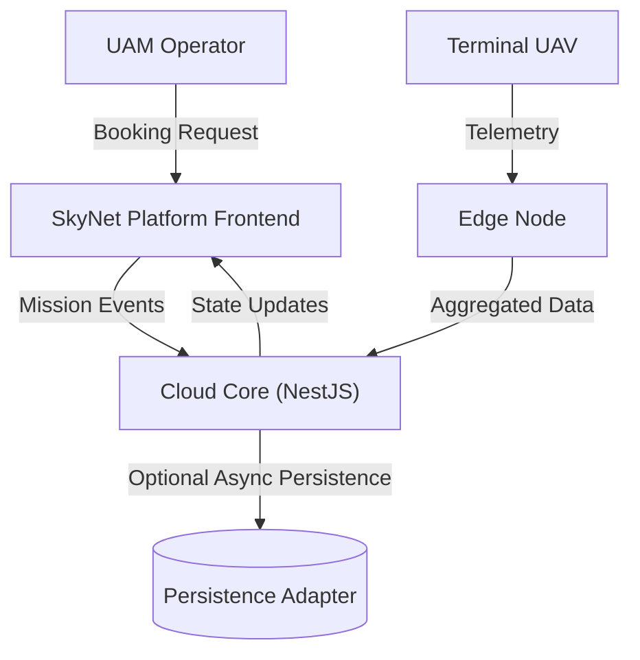

# SkyNetUAM: Lifecycle-Aware Low-Altitude UAM Operations Platform

[](https://opensource.org/licenses/Apache-2.0)
[](https://doi.org/10.20944/preprints202512.2648.v1)
[]()
[](https://www.python.org/downloads/)
[](https://pytorch.org/)

> **MobiHoc 2026 Reviewers:** The TR-GAT conflict detection code, `run.sh` one-click reproduction script, and all experiment artifacts are located at **[`modules/SkyFlow/`](./modules/SkyFlow)**. Run `cd modules/SkyFlow && bash run.sh` to reproduce all paper results.

> **KSEM 2026 Reviewers:** The SkyKG neuro-symbolic knowledge graph code and reproduction artifact are at **[`modules/SkyKg/artifact_ksem2026/`](./modules/SkyKg/artifact_ksem2026)**. Run `cd modules/SkyKg/artifact_ksem2026 && bash run.sh` to reproduce all paper results.

> **ISWC 2026 Reviewers:** The SkyRwa KG-driven flight-to-asset pipeline code and reproduction artifact are at **[`modules/SkyRwa/ISWC2026/`](./modules/SkyRwa/ISWC2026)**. Run `cd modules/SkyRwa/ISWC2026 && bash run.sh` (or `.\run.ps1` on Windows) to reproduce all paper results.

> **SkyGov Reviewers / Readers:** The evidence-driven multi-agent governance module for UAM compliance is located at **[`modules/SkyGov/`](./modules/SkyGov)**. For a quick demo run `cd modules/SkyGov && python scripts/run_governance.py`; for the latest evaluation pipeline run `python scripts/run_full_eval.py --scenarios 1000`.

---

> **Official implementation** of our Drones submission (2025): a mission-lifecycle-aware operational platform for scalable low-altitude UAM/drone operations.  
> Note: on-chain components are treated as an **optional audit/settlement extension** and do not change the core operational logic.

## 📖 Overview

**SkyNetUAM** is a lifecycle-aware operations platform for low-altitude UAM/drone missions. It models missions as first-class operational entities (Created → Scheduled → Active → Completed/Failed/Delayed), enabling consistent state propagation across scheduling, monitoring, reporting, and (optionally) durable state persistence for audit/settlement.

### Key Features
*   **Mission lifecycle management**: deterministic state machine with event-driven transitions and timestamped records.
*   **Operational dashboards (frontend demo)**: citizen booking, operator monitoring, and regulator oversight views.
*   **Operational State Service (backend)**: NestJS service that ingests mission events and maintains consistent lifecycle state.
*   **Optional persistence adapter**: can be enabled as an asynchronous extension for auditability/settlement-style workflows (kept out of the critical operational path).
*   **SkyFlow conflict detection** *(NEW)*: Temporal Relational Graph Attention Network (TR-GAT) for real-time multi-UAV conflict detection in dense low-altitude airspace — see [modules/SkyFlow](./modules/SkyFlow).
*   **SkyGov compliance governance** *(NEW)*: evidence-driven four-agent LLM governance pipeline for low-altitude regulatory compliance with hard-rule veto, explanation auditing, trust negotiation, and decision traceability — see [modules/SkyGov](./modules/SkyGov).
*   **SkyRwa flight-to-asset pipeline** *(NEW)*: knowledge graph–driven four-tier lifecycle (Evidence → Candidate → Product → Revenue Right) for transforming UAM flight data into governable data assets, with domain ontology, SHACL validation, SPARQL queryability, and explainable valuation — see [modules/SkyRwa](./modules/SkyRwa).

## 🏗️ System Architecture

The system is designed around a **Cloud-Edge-End** architecture as described in the "System Architecture" section of the paper, ensuring scalable and low-latency operations for UAM missions.

### Architecture Mapping

*   **`/cloud-core` (Cloud Layer)**: Hosts the **Operational State Service** (NestJS). Responsible for global management, mission scheduling, and state persistence.
*   **`/edge-node` (Edge Layer)**: Handles localized computing and storage logic (simulating DGX/GP Spark interaction). Features a high-performance storage engine interface.
*   **`/terminal-uav` (End/Terminal Layer)**: Simulates UAV data collection and telemetry generation.

This hierarchical design allows for:
1.  **Global Consistency**: Maintained by the cloud core.
2.  **Low Latency**: Achieved by edge processing.
3.  **Real-time Data**: Ingested from the terminal layer.


```mermaid
graph TD;
  A[UAM Operator] -->|Booking Request| B[SkyNet Platform Frontend];
  B -->|Mission Events| C["Cloud Core (NestJS)"];
  C -->|State Updates| B;
  C -->|Optional Async Persistence| D[(Persistence Adapter)];
  E[Terminal UAV] -->|Telemetry| F[Edge Node];
  F -->|Aggregated Data| C;
```

## 🚀 Getting Started

### Prerequisites
*   Node.js v18+
*   (Optional) Python 3.10+ for reproducible experiments

### Installation

1.  **Clone the repository**
    ```bash
    git clone https://github.com/liuyushugreat/SkyNetUamPlatform.git
    cd SkyNetUamPlatform
    ```

2.  **Install dependencies**
    ```bash
    npm install
    cd cloud-core && npm install
    ```

3.  **Run the backend Operational State Service (optional but recommended)**
    ```bash
    cd cloud-core
    npm run dev
    ```

4.  **Run the frontend**
    ```bash
    cd ..
    npm run dev
    ```

## 🛩️ SkyFlow: Temporal Relational Graph Attention for Real-Time UAV Conflict Detection

**SkyFlow** ([`modules/SkyFlow`](./modules/SkyFlow)) is a self-contained research module implementing **TR-GAT** (Temporally-conditioned Relational Graph Attention Network), an edge-assisted real-time conflict detection and resolution system for dense Urban Air Mobility (UAM) and Flying Ad Hoc Networks (FANETs). It models airspace dynamics as an evolving **Temporal Knowledge Graph (TKG)** and performs multi-hop relational reasoning over UAV trajectories, flight intents, and environmental constraints.

### Architecture

```
ADS-B Telemetry ─┐
Flight Plans ────┤                         ┌──────────────┐
Weather Grid ────┼──► TKG Builder (Alg.1) ─┤  TR-GAT      ├──► Conflict Head ──► PGD Resolution
Corridor Log ────┘    (< 12 ms)            │  L=4 layers  │    (Eq. 6, 2-MLP)   (Alg. 3, 20 steps)
                                           │  K=10 window  │
                   6 relation types        │  GRU recur.   │    Pairwise p_ij
                   + temporal encoding     └──────────────┘    + avoidance Δp_i
                     φ(δ) (Eq. 2)
```

### Key Results (UrbanAir-500 Benchmark, 500 simultaneous UAVs)

| Method | CDR | FAR | F1 | Latency (ms) |
|--------|:---:|:---:|:--:|:------------:|
| Velocity Obstacle | 0.6012 | 0.4231 | 0.5847 | 8.4 |
| LSTM-Pair | 0.7856 | 0.1923 | 0.7724 | 23.7 |
| Transformer-Pair | 0.8367 | 0.1547 | 0.8241 | 41.2 |
| STGCN | 0.8512 | 0.1389 | 0.8384 | 52.8 |
| GAT-Static | 0.8794 | 0.1156 | 0.8673 | 124.6 |
| TR-GAT-NoTemp | 0.8891 | 0.1023 | 0.8782 | 139.1 |
| **TR-GAT (Ours)** | **0.9247** | **0.0734** | **0.9132** | **147.3** |

### SkyFlow Components

| Component | Description |
|-----------|-------------|
| **TR-GAT Model** (`skyflow/models/tr_gat.py`) | 4-layer temporally-conditioned relational graph attention with sinusoidal temporal encoding φ(δ) and multi-relation gating |
| **TKG Builder** (`skyflow/data/tkg_builder.py`) | Constructs typed entity-relation-time graphs from ADS-B telemetry, flight plans, weather grids, and corridor reservations at 10 Hz |
| **UrbanAir-500 Simulator** (`skyflow/data/urbanair500.py`) | Physics-accurate benchmark with 500 concurrent UAVs over a 5 km × 5 km urban grid, stochastic wind field, GPS noise (CEP 2.5 m), and ADS-B latency |
| **Conflict Scoring Head** (`skyflow/models/conflict_head.py`) | 2-layer MLP producing pairwise conflict probability from concatenated TR-GAT embeddings and recurrent states |
| **Resolution Module** (`skyflow/models/resolution.py`) | Coordinated avoidance waypoint generation via Projected Gradient Descent for conflict clusters up to 12 aircraft |
| **6 Baselines** (`skyflow/baselines/`) | VO, LSTM-Pair, Transformer-Pair, STGCN, GAT-Static, TR-GAT-NoTemp — all parameter-matched |
| **Training Pipeline** (`skyflow/training/`) | AdamW + warmup + cosine annealing, focal loss (γ=2), observation window K=10, 5-seed evaluation with Bonferroni significance tests |

### 1-Click Reproducibility

```bash
cd modules/SkyFlow

# Full reproduction — all tables and figures (~14h on A100)
bash run.sh

# Quick verification (~5 min on CPU)
bash run.sh --quick

# Individual tables
bash scripts/reproduce_table3.sh      # Table 3
bash scripts/reproduce_table7.sh      # Table 7
```

## 🛡️ SkyGov: Evidence-Driven Multi-Agent Governance for UAM Compliance

**SkyGov** ([`modules/SkyGov`](./modules/SkyGov)) is a self-contained research module for low-altitude regulatory compliance and auditable LLM governance. It extends the single-agent KG-RAG style used in `SkyKg` into a four-agent workflow:

| Agent | Responsibility | Key mechanism |
|-------|----------------|---------------|
| `ComplianceAgent` | deterministic hard-rule compliance checking | SPARQL rule matching with veto power |
| `RiskAssessmentAgent` | semantic risk reasoning | knowledge-graph-enhanced retrieval + LLM |
| `ExplanationAgent` | traceable compliance explanation | rule-grounded natural language generation |
| `AuditAgent` | output quality control | RAR / LEC / UCR metrics with retry trigger |

### SkyGov Highlights

*   **Evidence-driven governance**: all LLM reasoning is grounded in ontology triples, regulations, and case evidence.
*   **Hard-rule first**: deterministic constraints short-circuit unsafe cases before probabilistic reasoning.
*   **Auditable explanation chain**: each decision can be traced to retrieved evidence, cited rules, and agent outputs.
*   **Layered trust protocol**: final decisions fuse veto, quality gate, and weighted voting.
*   **Reproducible evaluation**: includes benchmark, ablation, robustness, and end-to-end evaluation scripts.

### Quick Start

```bash
cd modules/SkyGov
pip install -r requirements.txt

# Optional: configure DeepSeek API key for real API runs
# Linux/macOS:
export DEEPSEEK_API_KEY="your_key_here"
# PowerShell:
$env:DEEPSEEK_API_KEY="your_key_here"

# Single-scenario demo
python scripts/run_governance.py

# Baseline / ablation runs
python scripts/run_ablation.py --scenarios 100 --mock

# Full evaluation: end-to-end metrics, robustness, sensitivity
python scripts/run_full_eval.py --scenarios 1000
```

See [`modules/SkyGov/README.md`](./modules/SkyGov/README.md) for module details.

## 📦 SkyRwa: KG-Driven Flight-to-Asset Pipeline for UAM Data Governance

**SkyRwa** ([`modules/SkyRwa`](./modules/SkyRwa)) is a self-contained research module implementing a **knowledge graph–driven flight-to-asset pipeline** that transforms raw UAM flight data into governable, tradable data assets through a four-tier lifecycle:

```
FlightEvidence ── governance ──► AssetCandidate ── aggregation ──► GovernedDataProduct ── settlement ──► RevenueRight
    (Tier 1)                       (Tier 2)                          (Tier 3)                             (Tier 4)
```

### SkyRwa Highlights

*   **Domain ontology**: 13 OWL classes, 26 properties, aligned with PROV-O, DCAT, ODRL 2.2, and Schema.org.
*   **Dual-layer governance**: Python rules + SHACL shapes detect 83% more violations than either alone.
*   **SPARQL queryability**: 6 competency questions + 4 analytical queries over the flight-to-asset knowledge graph.
*   **Explainable valuation**: structured explanation objects serialized to RDF, enabling machine-queryable reasoning.
*   **Cryptographic provenance**: Ed25519 signatures on flight evidence for tamper-evident attestation.
*   **Scalability**: linear growth to 1000 flights (66K triples) with ~66 triples/flight.

### Key Results (105-flight Benchmark, 10 Scenarios)

| Experiment | Key Finding |
|------------|-------------|
| **Governance Ablation** (Table 7) | Combined Python+SHACL detects 83% of violation types vs 50% (Python) or 33% (SHACL) alone |
| **Baseline Comparison** (Table 6) | SPARQL provides shorter, more maintainable queries for cross-entity lineage (3-hop traversal) |
| **Scalability** (Table 8) | Pipeline + RDF scales linearly; SHACL superlinear but acceptable (~9.6s for 1000 flights) |
| **Queryability** (Table 9) | All 6 competency questions (CQ1–CQ6) return correct results |

### 1-Click Reproducibility

```bash
cd modules/SkyRwa/ISWC2026

pip install -r requirements.txt

# Full reproduction — all tables and case studies (~2–5 min)
bash run.sh          # Linux/macOS
# .\run.ps1          # Windows PowerShell

# Individual experiments
python reproduce_table5.py       # Table 5: benchmark dataset
python reproduce_table6.py       # Table 6: JSON vs SPARQL
python reproduce_table7.py       # Table 7: governance ablation
python reproduce_table8.py       # Table 8: scalability
python reproduce_table9.py       # Table 9: SPARQL competency questions
python reproduce_case_studies.py # §7.6: case studies
```

See [`modules/SkyRwa/README.md`](./modules/SkyRwa/README.md) for module details.

## 🧪 Experiments & Reproduction

This repository includes the source code and simulation environment for our research on Low-Altitude Intelligent Internet storage architectures.

**Paper:** *Cloud-Edge-End Collaborative Data Storage Architecture*
**Simulation Module:** [`research/simulation/spark_simulation`](./research/simulation/spark_simulation)

### Reproducible Experiments
The following scripts generate the data and figures (Fig. 2-4) presented in the paper:
- **Experiment 1 (Throughput):** [Data Loading Simulation](./research/simulation/spark_simulation/exp1_throughput)
- **Experiment 2 (Latency):** [KV Cache Offloading Simulation](./research/simulation/spark_simulation/exp2_kv_cache)
- **Experiment 3 (Security):** [RWA Hardware Acceleration](./research/simulation/spark_simulation/exp3_rwa_security)

To reproduce the daily 100k-mission workload (used to stress lifecycle management under congestion and permission constraints):

```bash
python research/experiments/maddpg/simulate_100k_day.py
```

Outputs are written to `research/experiments/maddpg/outputs/` (CSV + publication-ready plots).

## 🗂️ Repository Structure

```
SkyNetUamPlatform/
├── apps/                    # Multi-role frontend (citizen, operator, regulator)
├── cloud-core/              # NestJS Operational State Service (Cloud Layer)
├── edge-node/               # Edge computing & storage interface (Edge Layer)
├── components/              # Shared React UI components
├── modules/
│   ├── SkyKg/               # Neuro-symbolic KG for UAM risk reasoning (KSEM 2026)
│   │   ├── SkyNet_Knowledge_Engine/  # Ontology + neuro-symbolic reasoning
│   │   ├── voxel_airspace_core/ # 3D spatial indexing & A* pathfinding
│   │   └── artifact_ksem2026/   # Paper reproduction: run.sh, data, scripts
│   ├── SkyRwa/              # KG-driven flight-to-asset pipeline (ISWC 2026)
│   │   ├── ontology/            # Domain ontology (13 classes, PROV-O/DCAT/ODRL)
│   │   ├── shapes/              # 5 SHACL constraint shapes
│   │   ├── queries/             # 10 SPARQL queries (6 CQ + 4 analytical)
│   │   ├── rdf/                 # RDF mapper, serializer, graph store
│   │   ├── semantic_rules/      # SHACL validator, governance/promotion/explanation
│   │   ├── productization/      # Multi-flight aggregation & catalogue
│   │   ├── provenance/          # Ed25519 signing + evidence builder
│   │   ├── experiments/         # Evaluation scripts
│   │   ├── benchmarks/          # 105-flight benchmark generator
│   │   └── ISWC2026/            # Paper reproduction: run.sh, tables, case studies
│   ├── SkyGov/              # Multi-agent compliance governance with auditable LLM reasoning
│   │   ├── skygov/          #   agents, orchestrator, RAG pipeline, governance utilities
│   │   ├── scripts/         #   governance demo, benchmark, ablation, full evaluation
│   │   ├── configs/         #   default thresholds and model settings
│   │   ├── outputs/         #   generated evaluation summaries
│   │   └── tests/           #   agent/workflow/governance tests
│   └── SkyFlow/             # TR-GAT conflict detection (MobiHoc 2026)
│       ├── skyflow/models/  #   TR-GAT, temporal encoding, conflict head, PGD resolution
│       ├── skyflow/data/    #   TKG builder, UrbanAir-500 simulator, SDD adapter
│       ├── skyflow/baselines/  # 6 comparison methods (parameter-matched)
│       ├── skyflow/training/#   AdamW + warmup + cosine, focal loss, regime metrics
│       ├── scripts/         #   1-click bash scripts, train, evaluate, reproduce
│       ├── configs/         #   Hyperparameter YAML (Table 2)
│       └── tests/           #   23 unit tests
├── nexus_core/              # Python core: MARL, economics, data fabric
├── packages/                # Shared TS packages (auth, ui, utils)
├── research/                # Simulation experiments & MADDPG
├── services/                # API client, mock data, Gemini integration
└── tools/                   # Refactoring & diagram generation scripts
```

See `docs/REPO_STRUCTURE.md` for additional details on the target directory layout.

## 🧩 Neo4j Integration

See `docs/neo4j.md` for how to start Neo4j via Docker and how to use it from the NestJS backend and Python utilities.

## 📚 Citation

If you use this code or framework in your research, please cite our papers:

```bibtex
@article{Liu2025SkyNetUAM,
  title={A Low-Altitude Urban Air Mobility Operations Platform with Mission Lifecycle Assetization},
  author={Liu, Yushu and Wang, Longbiao and Du, Chenglin and Zhai, Haixiao},
  journal={Preprints},
  volume={2025},
  pages={2025122648},
  year={2025},
  doi={10.20944/preprints202512.2648.v1}
}
```

If you use the SkyFlow conflict detection module specifically, please also cite:

```bibtex
@inproceedings{liu2026skyflow,
  title     = {SkyFlow: Temporal Relational Graph Attention for Real-Time
               UAV Conflict Detection},
  author    = {Liu, Yushu and Wang, Longbiao and Du, Chenglin and Zhai, Haixiao},
  booktitle = {Proceedings of the Twenty-seventh ACM International Symposium
               on Mobile Ad Hoc Networking and Computing (MobiHoc)},
  year      = {2026}
}
```

If you use the SkyKG knowledge graph module, please cite:

```bibtex
@inproceedings{liu2026skykg,
  title     = {SkyKG: A Neuro-Symbolic Knowledge Graph Framework for
               Explainable Risk Reasoning in Urban Air Mobility},
  author    = {Liu, Yushu and Wang, Longbiao and Du, Chenglin and Zhai, Haixiao},
  booktitle = {Proceedings of the 19th International Conference on
               Knowledge Science, Engineering and Management (KSEM)},
  year      = {2026}
}
```

If you use the SkyRwa flight-to-asset pipeline, please cite:

```bibtex
@inproceedings{liu2026skyrwa,
  title     = {From Flight Evidence to Governable Data Assets:
               A Knowledge Graph--Driven Flight-to-Asset Pipeline
               for Urban Air Mobility},
  author    = {Liu, Yushu and Wang, Longbiao and Du, Chenglin and Zhai, Haixiao},
  booktitle = {Proceedings of the 25th International Semantic Web
               Conference (ISWC)},
  year      = {2026}
}
```

If you use the SkyGov governance module, please also cite:

```bibtex
@article{liu2026skygov,
  title   = {SkyGov: An Evidence-Driven Multi-Agent Collaborative Reasoning System for UAM Compliance Governance},
  author  = {Liu, Yushu and Wang, Longbiao and Du, Chenglin},
  journal = {Journal of Computer Research and Development},
  year    = {2026},
  note    = {under review}
}
```

## 📄 License

This project is licensed under the Apache License 2.0 - see the [LICENSE](LICENSE) file for details.

---
*Developed by the SkyNet Research Team.*
