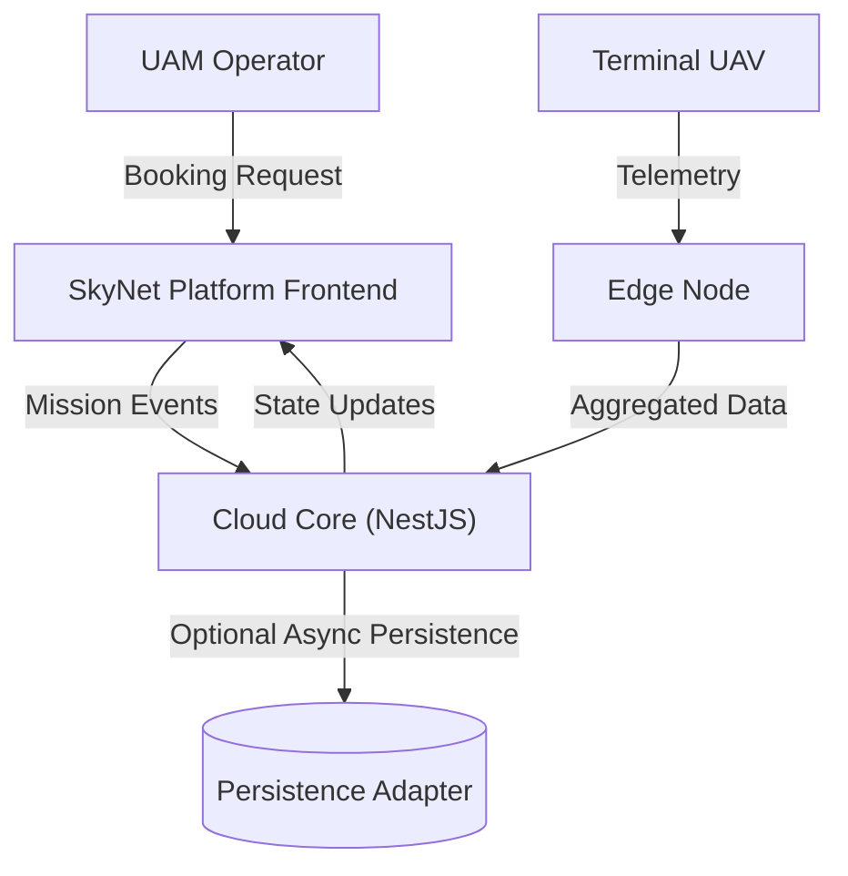

# SkyNetUAM: Lifecycle-Aware Low-Altitude UAM Operations Platform

[](https://opensource.org/licenses/Apache-2.0)
[](https://doi.org/10.20944/preprints202512.2648.v1)
[]()
[](https://www.python.org/downloads/)
[](https://pytorch.org/)

> **SkyRwa Paper Reviewers:** The SkyRwa KG-driven flight-to-asset pipeline code and reproduction artifact are at **[`modules/SkyRwa/reproduction/`](./modules/SkyRwa/reproduction)**. Run `cd modules/SkyRwa/reproduction && bash run.sh` (or `.\run.ps1` on Windows) to reproduce all paper results.

> **MobiHoc 2026 Reviewers:** The TR-GAT conflict detection code, `run.sh` one-click reproduction script, and all experiment artifacts are located at **[`modules/SkyFlow/`](./modules/SkyFlow)**. Run `cd modules/SkyFlow && bash run.sh` to reproduce all paper results.

> **KSEM 2026 Reviewers:** The SkyKG neuro-symbolic knowledge graph code and reproduction artifact are at **[`modules/SkyKg/artifact_ksem2026/`](./modules/SkyKg/artifact_ksem2026)**. Run `cd modules/SkyKg/artifact_ksem2026 && bash run.sh` to reproduce all paper results.

> **SkyGov Reviewers / Readers:** The evidence-driven multi-agent governance module for UAM compliance is located at **[`modules/SkyGov/`](./modules/SkyGov)**. For a quick demo run `cd modules/SkyGov && python scripts/run_governance.py`; for the latest evaluation pipeline run `python scripts/run_full_eval.py --scenarios 1000`.

> **ESORICS 2026 Reviewers:** The SkyCert assurance-layer code (conformal prediction + martingale monitoring + abstention policy for neuro-symbolic UAM risk reasoning) and its one-click reproduction artifact are at **[`modules/SkyCert/`](./modules/SkyCert)**. Run `cd modules/SkyCert && bash run.sh` (or `.\run.ps1` on Windows) to reproduce all paper tables and figures in ≈30 s on a single CPU core.

> **ICPP 2026 Reviewers:** The SkyGrid distributed edge-cloud runtime (STP partitioner + COP placer + ABP pipeline, with a deterministic discrete-event simulator, 7-config main table, component ablations, and scaling curves) and its one-click reproduction artifact are at **[`modules/SkyGrid/`](./modules/SkyGrid)**. Run `cd modules/SkyGrid && python -m pip install -e . && python scripts/run_experiment.py --config configs/default.yaml --out outputs/metrics.json` to reproduce the main table in ~3 minutes on a single CPU core; see [`modules/SkyGrid/README.md`](./modules/SkyGrid/README.md) for the full pipeline.

> **RTSS 2026 Reviewers:** The SkyShield field-validated radar-guided counter-UAV interception runtime (FIFO/RM/EDF/EDF+slack scheduler, covariance-weighted multi-radar fusion, runtime safety guard, bounded fail-safe abort with a 200 ms abort deadline) and its one-click reproduction artifact are at **[`modules/SkyShield/`](./modules/SkyShield)**. It reproduces a verbatim 10-sortie field campaign (80 % mission success) and extends it with 50 deterministically seeded augmented sorties, reaching an end-to-end P99 of **391 ms against a 1500 ms deadline**, a **3.3 %** deadline-miss ratio, a **100 %** abort-within-deadline rate, and a **100 %** correct-response rate over 600 binomial safety trials (95 % lower-CI 0.964). Run `cd modules/SkyShield && bash run.sh` (or `./run.ps1` on Windows) to regenerate every paper number, figure, and PDF in under ten minutes on a single CPU core; see [`modules/SkyShield/README.md`](./modules/SkyShield/README.md) and the anonymous source at [`pressRequire/SkyShield/SkyShield_RTSS2026`](./pressRequire/SkyShield/SkyShield_RTSS2026).

---

> **Official implementation** of our Drones submission (2025): a mission-lifecycle-aware operational platform for scalable low-altitude UAM/drone operations.  
> Note: on-chain components are treated as an **optional audit/settlement extension** and do not change the core operational logic.

## 📖 Overview

**SkyNetUAM** is a lifecycle-aware operations platform for low-altitude UAM/drone missions. It models missions as first-class operational entities (Created → Scheduled → Active → Completed/Failed/Delayed), enabling consistent state propagation across scheduling, monitoring, reporting, and (optionally) durable state persistence for audit/settlement.

### Key Features
*   **Mission lifecycle management**: deterministic state machine with event-driven transitions and timestamped records.
*   **Operational dashboards (frontend demo)**: citizen booking, operator monitoring, and regulator oversight views.
*   **Operational State Service (backend)**: NestJS service that ingests mission events and maintains consistent lifecycle state.
*   **Optional persistence adapter**: can be enabled as an asynchronous extension for auditability/settlement-style workflows (kept out of the critical operational path).
*   **SkyFlow conflict detection** *(NEW)*: Temporal Relational Graph Attention Network (TR-GAT) for real-time multi-UAV conflict detection in dense low-altitude airspace — see [modules/SkyFlow](./modules/SkyFlow).
*   **SkyGov compliance governance** *(NEW)*: evidence-driven four-agent LLM governance pipeline for low-altitude regulatory compliance with hard-rule veto, explanation auditing, trust negotiation, and decision traceability — see [modules/SkyGov](./modules/SkyGov).
*   **SkyRwa semantic lifecycle modeling** *(NEW)*: four-tier governance lifecycle (Evidence → Candidate → Product → Revenue Right) where governance transitions are first-class KG entities, validated by SHACL + SHACL-SPARQL constraints, with 100% violation-type coverage — see [modules/SkyRwa](./modules/SkyRwa).
*   **SkyCert conformal assurance layer** *(NEW)*: uncertainty-calibrated neuro-symbolic risk reasoning for UAM — split-conformal prediction with finite-sample coverage, hybrid-nonconformity test-martingales for online shift detection, and an abstention/alert/escalation policy that emits machine-readable audit artifacts — see [modules/SkyCert](./modules/SkyCert).
*   **SkyShield counter-UAV real-time runtime** *(NEW)*: deadline-aware runtime for radar-guided kinetic counter-UAV interception — RM+EDF+slack-stealing scheduler enforcing a 1.5 s end-to-end deadline and a 200 ms hard abort deadline, covariance-weighted multi-radar fusion with explicit handoff latency, and a runtime safety guard that gates every launch on authorization, geofence, friendly-airspace, and classification-confidence preconditions; validated on a verbatim 10-sortie field trial with a $300\,\text{km}^2$ urban replay benchmark — see [modules/SkyShield](./modules/SkyShield).

## 🏗️ System Architecture

The system is designed around a **Cloud-Edge-End** architecture as described in the "System Architecture" section of the paper, ensuring scalable and low-latency operations for UAM missions.

### Architecture Mapping

*   **`/cloud-core` (Cloud Layer)**: Hosts the **Operational State Service** (NestJS). Responsible for global management, mission scheduling, and state persistence.
*   **`/edge-node` (Edge Layer)**: Handles localized computing and storage logic (simulating DGX/GP Spark interaction). Features a high-performance storage engine interface.
*   **`/terminal-uav` (End/Terminal Layer)**: Simulates UAV data collection and telemetry generation.

This hierarchical design allows for:
1.  **Global Consistency**: Maintained by the cloud core.
2.  **Low Latency**: Achieved by edge processing.
3.  **Real-time Data**: Ingested from the terminal layer.


```mermaid
graph TD;
  A[UAM Operator] -->|Booking Request| B[SkyNet Platform Frontend];
  B -->|Mission Events| C["Cloud Core (NestJS)"];
  C -->|State Updates| B;
  C -->|Optional Async Persistence| D[(Persistence Adapter)];
  E[Terminal UAV] -->|Telemetry| F[Edge Node];
  F -->|Aggregated Data| C;
```

## 🚀 Getting Started

### Prerequisites
*   Node.js v18+
*   (Optional) Python 3.10+ for reproducible experiments

### Installation

1.  **Clone the repository**
    ```bash
    git clone https://github.com/liuyushugreat/SkyNetUamPlatform.git
    cd SkyNetUamPlatform
    ```

2.  **Install dependencies**
    ```bash
    npm install
    cd cloud-core && npm install
    ```

3.  **Run the backend Operational State Service (optional but recommended)**
    ```bash
    cd cloud-core
    npm run dev
    ```

4.  **Run the frontend**
    ```bash
    cd ..
    npm run dev
    ```

## 🛩️ SkyFlow: Temporal Relational Graph Attention for Real-Time UAV Conflict Detection

**SkyFlow** ([`modules/SkyFlow`](./modules/SkyFlow)) is a self-contained research module implementing **TR-GAT** (Temporally-conditioned Relational Graph Attention Network), an edge-assisted real-time conflict detection and resolution system for dense Urban Air Mobility (UAM) and Flying Ad Hoc Networks (FANETs). It models airspace dynamics as an evolving **Temporal Knowledge Graph (TKG)** and performs multi-hop relational reasoning over UAV trajectories, flight intents, and environmental constraints.

### Architecture

```
ADS-B Telemetry ─┐
Flight Plans ────┤                         ┌──────────────┐
Weather Grid ────┼──► TKG Builder (Alg.1) ─┤  TR-GAT      ├──► Conflict Head ──► PGD Resolution
Corridor Log ────┘    (< 12 ms)            │  L=4 layers  │    (Eq. 6, 2-MLP)   (Alg. 3, 20 steps)
                                           │  K=10 window  │
                   6 relation types        │  GRU recur.   │    Pairwise p_ij
                   + temporal encoding     └──────────────┘    + avoidance Δp_i
                     φ(δ) (Eq. 2)
```

### Key Results (UrbanAir-500 Benchmark, 500 simultaneous UAVs)

| Method | CDR | FAR | F1 | Latency (ms) |
|--------|:---:|:---:|:--:|:------------:|
| Velocity Obstacle | 0.6012 | 0.4231 | 0.5847 | 8.4 |
| LSTM-Pair | 0.7856 | 0.1923 | 0.7724 | 23.7 |
| Transformer-Pair | 0.8367 | 0.1547 | 0.8241 | 41.2 |
| STGCN | 0.8512 | 0.1389 | 0.8384 | 52.8 |
| GAT-Static | 0.8794 | 0.1156 | 0.8673 | 124.6 |
| TR-GAT-NoTemp | 0.8891 | 0.1023 | 0.8782 | 139.1 |
| **TR-GAT (Ours)** | **0.9247** | **0.0734** | **0.9132** | **147.3** |

### SkyFlow Components

| Component | Description |
|-----------|-------------|
| **TR-GAT Model** (`skyflow/models/tr_gat.py`) | 4-layer temporally-conditioned relational graph attention with sinusoidal temporal encoding φ(δ) and multi-relation gating |
| **TKG Builder** (`skyflow/data/tkg_builder.py`) | Constructs typed entity-relation-time graphs from ADS-B telemetry, flight plans, weather grids, and corridor reservations at 10 Hz |
| **UrbanAir-500 Simulator** (`skyflow/data/urbanair500.py`) | Physics-accurate benchmark with 500 concurrent UAVs over a 5 km × 5 km urban grid, stochastic wind field, GPS noise (CEP 2.5 m), and ADS-B latency |
| **Conflict Scoring Head** (`skyflow/models/conflict_head.py`) | 2-layer MLP producing pairwise conflict probability from concatenated TR-GAT embeddings and recurrent states |
| **Resolution Module** (`skyflow/models/resolution.py`) | Coordinated avoidance waypoint generation via Projected Gradient Descent for conflict clusters up to 12 aircraft |
| **6 Baselines** (`skyflow/baselines/`) | VO, LSTM-Pair, Transformer-Pair, STGCN, GAT-Static, TR-GAT-NoTemp — all parameter-matched |
| **Training Pipeline** (`skyflow/training/`) | AdamW + warmup + cosine annealing, focal loss (γ=2), observation window K=10, 5-seed evaluation with Bonferroni significance tests |

### 1-Click Reproducibility

```bash
cd modules/SkyFlow

# Full reproduction — all tables and figures (~14h on A100)
bash run.sh

# Quick verification (~5 min on CPU)
bash run.sh --quick

# Individual tables
bash scripts/reproduce_table3.sh      # Table 3
bash scripts/reproduce_table7.sh      # Table 7
```

## 🛡️ SkyGov: Evidence-Driven Multi-Agent Governance for UAM Compliance

**SkyGov** ([`modules/SkyGov`](./modules/SkyGov)) is a self-contained research module for low-altitude regulatory compliance and auditable LLM governance. It extends the single-agent KG-RAG style used in `SkyKg` into a four-agent workflow:

| Agent | Responsibility | Key mechanism |
|-------|----------------|---------------|
| `ComplianceAgent` | deterministic hard-rule compliance checking | SPARQL rule matching with veto power |
| `RiskAssessmentAgent` | semantic risk reasoning | knowledge-graph-enhanced retrieval + LLM |
| `ExplanationAgent` | traceable compliance explanation | rule-grounded natural language generation |
| `AuditAgent` | output quality control | RAR / LEC / UCR metrics with retry trigger |

### SkyGov Highlights

*   **Evidence-driven governance**: all LLM reasoning is grounded in ontology triples, regulations, and case evidence.
*   **Hard-rule first**: deterministic constraints short-circuit unsafe cases before probabilistic reasoning.
*   **Auditable explanation chain**: each decision can be traced to retrieved evidence, cited rules, and agent outputs.
*   **Layered trust protocol**: final decisions fuse veto, quality gate, and weighted voting.
*   **Reproducible evaluation**: includes benchmark, ablation, robustness, and end-to-end evaluation scripts.

### Quick Start

```bash
cd modules/SkyGov
pip install -r requirements.txt

# Optional: configure DeepSeek API key for real API runs
# Linux/macOS:
export DEEPSEEK_API_KEY="your_key_here"
# PowerShell:
$env:DEEPSEEK_API_KEY="your_key_here"

# Single-scenario demo
python scripts/run_governance.py

# Baseline / ablation runs
python scripts/run_ablation.py --scenarios 100 --mock

# Full evaluation: end-to-end metrics, robustness, sensitivity
python scripts/run_full_eval.py --scenarios 1000
```

See [`modules/SkyGov/README.md`](./modules/SkyGov/README.md) for module details.

## 📦 SkyRwa: Modeling Governable Flight-to-Asset Lifecycles

**SkyRwa** ([`modules/SkyRwa`](./modules/SkyRwa)) formalizes the governance transitions that transform raw UAM flight data into tradable data assets as first-class semantic objects in a knowledge graph, through a four-tier governance lifecycle:

```
FlightEvidence ── governance ──► AssetCandidate ── aggregation ──► GovernedDataProduct ── settlement ──► RevenueRight
    (Tier 1)                       (Tier 2)                          (Tier 3)                             (Tier 4)
```

### SkyRwa Highlights

*   **Domain ontology**: 13 OWL classes, 26 properties, aligned with PROV-O, DCAT, ODRL 2.2, and Schema.org.
*   **Dual-layer governance**: Python rules + SHACL/SHACL-SPARQL shapes achieve 100% violation-type coverage (50% for either alone).
*   **SPARQL queryability**: 6 competency questions + 4 analytical queries; cross-entity lineage with third-party verifiability.
*   **Governance-aware valuation metadata**: illustrative, not pricing — the contribution is semantic representation of valuation rationale.
*   **Cryptographic provenance**: Ed25519 signatures on flight evidence for tamper-evident attestation.
*   **Reproducible benchmark**: 105 flights, 10 scenarios, fixed seed (42), documented distributions, coverage matrix.
*   **Scalability**: linear growth to 1000 flights (66K triples); deterministic across independent runs.

### Key Results (105-flight Benchmark, 10 Scenarios)

| Experiment | Key Finding |
|------------|-------------|
| **Governance Ablation** (Table 7) | Combined Python+SHACL achieves 100% violation-type coverage vs 50% for either alone |
| **Baseline Comparison** (Table 6) | SPARQL enables third-party verifiable, interoperable queries for cross-entity lineage |
| **Scalability** (Table 8) | Pipeline + RDF scales linearly; SHACL superlinear but acceptable (~9.6s for 1000 flights) |
| **Queryability** (Table 9) | All 6 competency questions (CQ1–CQ6) return correct results |

### 1-Click Reproducibility

```bash
cd modules/SkyRwa/reproduction

pip install -r requirements.txt

# Full reproduction — all tables and case studies (~2–5 min)
bash run.sh          # Linux/macOS
# .\run.ps1          # Windows PowerShell

# Individual experiments
python reproduce_table5.py       # Table 5: benchmark dataset
python reproduce_table6.py       # Table 6: JSON vs SPARQL
python reproduce_table7.py       # Table 7: governance ablation
python reproduce_table8.py       # Table 8: scalability
python reproduce_table9.py       # Table 9: SPARQL competency questions
python reproduce_robustness.py   # Robustness: multi-run, scale, thresholds
python reproduce_case_studies.py # §7.7: case studies
```

See [`modules/SkyRwa/README.md`](./modules/SkyRwa/README.md) for module details.

## 🌐 SkyGrid: Distributed Edge-Cloud Runtime for City-Scale Neuro-Symbolic UAM Reasoning

**SkyGrid** ([`modules/SkyGrid`](./modules/SkyGrid)) is the *parallel/distributed runtime layer* of the platform.
It takes a hybrid neural + symbolic reasoning DAG and schedules it across a realistic edge-cloud fabric
so that city-scale UAM telemetry can be reasoned about at 12 K ops/s with bounded tail latency and an
order-of-magnitude less cross-edge traffic than cloud-only serving.

```
Entities (105 entities, 60 s)                ┌──────────────┐
  │ telemetry stream                          │   STP        │ spatial grid + FM refinement
  ▼                                           │ partitioner  │ (bounded imbalance, low cut)
 ┌────────────┐   ┌───────────────┐           └──────┬───────┘
 │ feat_extract│─►│ risk_score(NN)│──┐               │
 └────────────┘   └───────────────┘  │        ┌──────▼─────────┐
                                      ├──────►│  COP placer    │ closed-form cost model
 ┌────────────┐   ┌───────────────┐  │        │ greedy + swap  │ (compute+transfer+queue)
 │ rule_check │──►│  conformal    │──┤        └──────┬─────────┘
 └────────────┘   └───────────────┘  │               │
                                      ▼        ┌─────▼──────┐
                                  ┌──────┐    │  ABP       │ micro-batching, bounded
                                  │ audit│    │  pipeline  │ staleness, per-stage
                                  └──────┘    └────────────┘ backpressure
```

### SkyGrid Highlights

*   **Spatio-Temporal Partitioning (STP)**: spatial-grid partitioner with rule-dependency-aware FM refinement;
    reduces edge cut from 0.761 to **0.077** (10×) and spatial compactness from 29.4 to **12.4** at the
    default 10 K-entity regime.
*   **Cost-aware Operator Placement (COP)**: closed-form compute + transfer + queueing cost model with
    a greedy initializer and bounded local-swap search; within ε of the ILP optimum on the paper workloads,
    but runs in milliseconds instead of minutes.
*   **Asynchronous Batched Pipeline (ABP)**: per-stage micro-batchers with bounded staleness and
    back-pressure that keep the hybrid DAG stable at 12 K ops/s with sub-60 ms p99 latency.
*   **Fully-simulated fabric**: a discrete-event simulator models GPU batch-efficiency curves, link
    serialization + jitter, and queue dynamics; all numbers in the paper are seed-pinned and
    deterministically reproducible on a single CPU core.
*   **One-click reviewer pipeline**: `run_experiment.py` → `run_ablation.py` → `run_scaling.py` →
    `plot_results.py` regenerates every table and figure of the ICPP 2026 paper in under 10 minutes.

### Key Results (default config, 10 K entities, 60 s virtual horizon, `seed 20260928`)

| Configuration | p50 (ms) | p95 (ms) | p99 (ms) | Cross-edge bytes | Throughput |
|---|:---:|:---:|:---:|:---:|:---:|
| cloud-only                       | 64.0 | 76.3 | 84.5 | 1 215 MB | 12.17 K ops/s |
| edge-only                        | 33.5 | 53.2 | 58.3 |   351 MB | 12.16 K ops/s |
| hash + static                    | 75.5 | 85.6 | 88.7 | 1 475 MB | 12.16 K ops/s |
| LDG + static                     | 75.2 | 85.5 | 88.7 | 1 471 MB | 12.16 K ops/s |
| LDG + COP                        | 33.7 | 53.1 | 58.2 |   348 MB | 12.16 K ops/s |
| **SkyGrid (STP + COP + ABP)**   | **32.3** | **49.3** | **55.6** | **150 MB** | 12.16 K ops/s |

Against the strongest static baseline, SkyGrid delivers **−29 % p95 tail**, **−37 % p99 tail**, and
**−88 % cross-edge traffic** (150 MB vs. 1.22 GB for cloud-only) without losing throughput.

### 1-Click Reproducibility

```bash
cd modules/SkyGrid

python -m pip install -r requirements.txt
python -m pip install -e .

# Full reproduction — main table + ablations + scaling + figures (~5–10 min, CPU-only)
python scripts/run_experiment.py --config configs/default.yaml --out outputs/metrics.json
python scripts/run_ablation.py   --config configs/default.yaml --out outputs/ablation
python scripts/run_scaling.py    --config configs/scaling.yaml --out outputs/scaling
python scripts/plot_results.py   --metrics outputs/metrics.json \
                                 --ablation outputs/ablation \
                                 --scaling outputs/scaling \
                                 --out outputs/figs

# Unit tests (18 cases)
pytest -q
```

See [`modules/SkyGrid/README.md`](./modules/SkyGrid/README.md) for module internals, extension points,
and the ICPP 2026 paper source at [`pressRequire/SkyGrid/SkyGrid_ICPP2026`](../pressRequire/SkyGrid/SkyGrid_ICPP2026).

## 🛡️ SkyCert: Uncertainty-Calibrated Neuro-Symbolic Reasoning with Conformal Prediction for UAM

**SkyCert** ([`modules/SkyCert`](./modules/SkyCert)) is the *assurance layer* of the platform. It wraps any neuro-symbolic risk reasoner (neural scorer + symbolic rule engine over a UAM knowledge-graph slice) with three complementary mechanisms that turn opaque risk scores into auditable, certification-friendly decisions:

```
Neural scorer ─┐                ┌─ Conformal Risk Set ─┐                      ┌─ ACCEPT ─┐
Rule engine ───┼─► logits/trace ┤                      ├─► Assurance Policy ──┼─ ABSTAIN │
Feature stream ┘                └─ Martingale Monitor ─┘                      ├─ ALERT   │
                                      (hybrid NC score)                       └─ ESCALATE┘
                                                                       │
                                                               Audit artifact (JSONL)
```

### SkyCert Highlights

*   **Conformal coverage guarantee**: split-conformal prediction with APS nonconformity; marginal coverage stays within ±0.03 of the `1 − α` target under KG corruption, rule poisoning, and feature attack.
*   **Online shift detection**: hybrid-nonconformity test-martingale (confidence slack + standardized input drift) with simple-jumper betting; warm-started from the calibration set so it is a valid conformal test-martingale from the first test point.
*   **Safety-aware decision gating**: four-way ACCEPT / ABSTAIN / ALERT / ESCALATE policy — halves the critical-class miss rate under covariate shift (0.494 → 0.290).
*   **Explicit threat model**: knowledge-graph corruption (T1), rule poisoning (T2), feature manipulation (T3), and covariate shift (T4), each reproduced by a deterministic injector in `skycert/data/threats.py`.
*   **Machine-readable audit artifacts**: every decision is persisted as a JSONL record (rule trace + conformal set + martingale trajectory + verdict) to back an offline certification argument.
*   **Reproducibility**: CPU-only, seed-pinned (`20260417`), ≈30 s end-to-end, no GPU / API key / network access required.

### Key Results (default reviewer config, `seed 20260417`)

| Scenario | Coverage | Crit. err. base → after abstain | Alert | M_max | Delay |
|---|:---:|:---:|:---:|:---:|:---:|
| T0 Clean            | 0.899 | 0.364 → **0.312** | 0.000 | 7.10 | — |
| T1 KG corruption    | 0.905 | 0.240 → **0.179** | 0.000 | 4.69 | — |
| T2 Rule poisoning   | 0.909 | 0.403 → **0.348** | 0.000 | 6.53 | — |
| T3 Feature attack   | 0.881 | 0.351 → **0.267** | 0.358 | 2.2 × 10⁸ | 413 |
| T4 Covariate shift  | 0.691 | 0.494 → **0.290** | 0.486 | 1.3 × 10⁵⁵ | 40 |

Ablation under T4 — the full SkyCert configuration dominates every variant on the safety-critical metric:

| Variant | Crit. err. after abstain |
|---|:---:|
| `no_conformal`  | 0.320 |
| `no_martingale` | 0.329 |
| `no_abstention` | 0.376 |
| **`full` SkyCert** | **0.275** |

### 1-Click Reproducibility

```bash
cd modules/SkyCert

pip install -r requirements.txt

# Full reproduction — unit tests + 5-threat experiment + ablation + 3 figures (~30 s, CPU-only)
bash run.sh          # Linux/macOS
# .\run.ps1          # Windows PowerShell

# Individual steps
python -m pytest tests -q                                   # 9 unit tests
python -m scripts.run_experiment --config configs/default.yaml  # Table 1 + audit/
python -m scripts.run_ablation   --config configs/default.yaml  # Table 2
python -m scripts.plot_results   --config configs/default.yaml  # Fig. 3–5 (PDF)
```

See [`modules/SkyCert/README.md`](./modules/SkyCert/README.md) for module details, threat-model definitions, and the full paper-to-code mapping.

## 🛰️ SkyShield: Field-Validated Real-Time Counter-UAV Interception

**SkyShield** ([`modules/SkyShield`](./modules/SkyShield)) is the
*real-time CPS layer* of the platform. It turns the stack from
radar detection to physical interceptor reaction into a single
closed-loop job with an explicit end-to-end deadline $D_{e2e} = 1500$
ms and an explicit abort deadline $R_3 = 200$ ms, and evaluates the
result against a **ten-sortie real field interception campaign** plus
a deterministically seeded replay-and-stress battery over a
$300\,\text{km}^2$ urban district.

```
Radar packets (4 PLFM nodes)        ┌──────────────────────────┐
  │                                  │  Sensing plane           │
  ▼                                  │  fuse + Kalman + M-of-N  │
 ┌──────────────┐   ┌──────────────┐ └──────────┬───────────────┘
 │ RadarNode    │──►│ MultiRadarFuser│            │ Confirmed track
 └──────────────┘   └──────────────┘            ┌──▼────────────────┐
                                                │ Decision plane    │
                                                │ threat + EDF+slack│
                                                │ + safety guard    │
                                                └──┬────────────────┘
                                                   │ Authorised launch
                                                ┌──▼────────────────┐
                                                │ Actuation plane   │
                                                │ interceptor       │
                                                │ kinematics + abort│
                                                └───────────────────┘
```

### SkyShield Highlights

*   **Three-plane architecture with a stage budget table** that
    statically composes $D_{e2e}=1500$ ms from seven per-stage
    budgets; the union-bound schedulability certificate is
    discharged by observing every stage's P99 inside its budget.
*   **EDF + slack-stealing scheduler** that biases the tail toward
    the more dangerous threat when the current job's slack drops
    below a threshold; yields **−22 %** P99 end-to-end latency vs.
    FIFO under four-way concurrency.
*   **Runtime safety guard** that checks authorization,
    target-class confidence, friendly-airspace geofence, and
    threat-threshold in a fixed order; returns `ALLOW` /
    `SUPPRESS` / `ABORT` with **100 % correct response** over six
    safety scenarios × 100 binomial trials.
*   **Bounded fail-safe abort controller** that refuses to promise
    `return_safe` when $R_3$ would be breached; achieves
    **100 %** abort-within-deadline compliance in our evaluation.
*   **Field-validated, fully reproducible**: 10 verbatim sorties
    encoded in `data/field_sorties.json`, 50 augmented seeds in
    `data/augmented_seeds.json`, all seeds pinned in
    `configs/default.yaml` (`seed 20260418`).

### Key Results (default config, 10 field + 50 augmented sorties, `seed 20260418`)

| Metric                                   | SkyShield | Budget / baseline |
|------------------------------------------|:---------:|:-----------------:|
| Mission success rate                     | **0.68**  |           —       |
| End-to-end P99 latency                   | **391 ms**| 1500 ms deadline  |
| Deadline-miss ratio                      | **3.3 %** |        —          |
| Abort within 200 ms                      | **100 %** | hard $R_3$        |
| Return-safe rate after abort             | **100 %** |        —          |
| False-launch suppression on confirmed tracks | 5.0 %  |        —          |
| Worst-case P99 under E3 stress (auth-delay regime) | 588 ms | still under budget |
| P99 vs. FIFO at concurrency 4 (E5)       | **−22 %** | ablation baseline |
| Safety scenarios correct / trials        | 600/600   |   95 % LCB 0.964  |

### 1-Click Reproducibility

```bash
cd modules/SkyShield

python -m pip install -r requirements.txt

bash run.sh          # Linux/macOS
# ./run.ps1          # Windows PowerShell

# Or step by step:
python scripts/run_field_replay.py     # E1 field replay
python scripts/run_timing.py           # E2 end-to-end timing
python scripts/run_replay_stress.py    # E3 stress regimes
python scripts/run_multi_radar.py      # E4 urban deployment sweep
python scripts/run_ablation.py         # E5 ablation
python scripts/run_safety.py           # E6 safety & failure
python scripts/plot_results.py         # regenerate every figure
pytest -q                              # unit + integration tests
```

See [`modules/SkyShield/README.md`](./modules/SkyShield/README.md)
for module internals, scheduler policies, and the full
paper-to-code mapping, and the RTSS 2026 anonymous source at
[`pressRequire/SkyShield/SkyShield_RTSS2026`](./pressRequire/SkyShield/SkyShield_RTSS2026).

## 🧪 Experiments & Reproduction

This repository includes the source code and simulation environment for our research on Low-Altitude Intelligent Internet storage architectures.

**Paper:** *Cloud-Edge-End Collaborative Data Storage Architecture*
**Simulation Module:** [`research/simulation/spark_simulation`](./research/simulation/spark_simulation)

### Reproducible Experiments
The following scripts generate the data and figures (Fig. 2-4) presented in the paper:
- **Experiment 1 (Throughput):** [Data Loading Simulation](./research/simulation/spark_simulation/exp1_throughput)
- **Experiment 2 (Latency):** [KV Cache Offloading Simulation](./research/simulation/spark_simulation/exp2_kv_cache)
- **Experiment 3 (Security):** [RWA Hardware Acceleration](./research/simulation/spark_simulation/exp3_rwa_security)

To reproduce the daily 100k-mission workload (used to stress lifecycle management under congestion and permission constraints):

```bash
python research/experiments/maddpg/simulate_100k_day.py
```

Outputs are written to `research/experiments/maddpg/outputs/` (CSV + publication-ready plots).

## 🗂️ Repository Structure

```
SkyNetUamPlatform/
├── apps/                    # Multi-role frontend (citizen, operator, regulator)
├── cloud-core/              # NestJS Operational State Service (Cloud Layer)
├── edge-node/               # Edge computing & storage interface (Edge Layer)
├── components/              # Shared React UI components
├── modules/
│   ├── SkyKg/               # Neuro-symbolic KG for UAM risk reasoning (KSEM 2026)
│   │   ├── SkyNet_Knowledge_Engine/  # Ontology + neuro-symbolic reasoning
│   │   ├── voxel_airspace_core/ # 3D spatial indexing & A* pathfinding
│   │   └── artifact_ksem2026/   # Paper reproduction: run.sh, data, scripts
│   ├── SkyRwa/              # KG-driven flight-to-asset pipeline (journal artifact)
│   │   ├── ontology/            # Domain ontology (13 classes, PROV-O/DCAT/ODRL)
│   │   ├── shapes/              # 5 SHACL constraint shapes
│   │   ├── queries/             # 10 SPARQL queries (6 CQ + 4 analytical)
│   │   ├── rdf/                 # RDF mapper, serializer, graph store
│   │   ├── semantic_rules/      # SHACL validator, governance/promotion/explanation
│   │   ├── productization/      # Multi-flight aggregation & catalogue
│   │   ├── provenance/          # Ed25519 signing + evidence builder
│   │   ├── experiments/         # Evaluation scripts (incl. robustness)
│   │   ├── benchmark_generator/ # Reproducible generator (seed, distributions, coverage)
│   │   ├── benchmarks/          # Legacy benchmark generator
│   │   └── reproduction/        # Paper reproduction: run.sh, 13-step pipeline
│   ├── SkyGov/              # Multi-agent compliance governance with auditable LLM reasoning
│   │   ├── skygov/          #   agents, orchestrator, RAG pipeline, governance utilities
│   │   ├── scripts/         #   governance demo, benchmark, ablation, full evaluation
│   │   ├── configs/         #   default thresholds and model settings
│   │   ├── outputs/         #   generated evaluation summaries
│   │   └── tests/           #   agent/workflow/governance tests
│   ├── SkyFlow/             # TR-GAT conflict detection (MobiHoc 2026)
│   │   ├── skyflow/models/  #   TR-GAT, temporal encoding, conflict head, PGD resolution
│   │   ├── skyflow/data/    #   TKG builder, UrbanAir-500 simulator, SDD adapter
│   │   ├── skyflow/baselines/  # 6 comparison methods (parameter-matched)
│   │   ├── skyflow/training/#   AdamW + warmup + cosine, focal loss, regime metrics
│   │   ├── scripts/         #   1-click bash scripts, train, evaluate, reproduce
│   │   ├── configs/         #   Hyperparameter YAML (Table 2)
│   │   └── tests/           #   23 unit tests
│   ├── SkyCert/             # Conformal + martingale assurance layer (ESORICS 2026)
│   │   ├── skycert/base/    #   Neural scorer + symbolic rule engine (+ fused reasoner)
│   │   ├── skycert/assurance/ # Conformal risk set, martingale monitor, policy, audit logger
│   │   ├── skycert/data/    #   Synthetic UAM dataset + T1–T4 threat injectors
│   │   ├── skycert/pipeline.py #  End-to-end SkyCertPipeline (fit / calibrate / step)
│   │   ├── scripts/         #   run_experiment, run_ablation, plot_results
│   │   ├── configs/         #   default.yaml (reviewer-facing, seed 20260417)
│   │   ├── run.sh / run.ps1 #   One-click reproduction (Linux/macOS / Windows)
│   │   └── tests/           #   9 unit tests (conformal, martingale, policy)
│   └── SkyShield/           # Field-validated real-time counter-UAV runtime (RTSS 2026)
│       ├── skyshield/radar/     # PLFM node + covariance-weighted multi-radar fusion
│       ├── skyshield/tracker/   # CV Kalman + M-of-N confirmation
│       ├── skyshield/decision/  # threat + EDF+slack scheduler + safety guard + bounded abort
│       ├── skyshield/interceptor/ # kinematics model + launch gate
│       ├── skyshield/runtime/   # DES engine and virtual clock
│       ├── skyshield/telemetry/ # span tracer + RunMetrics
│       ├── scripts/             # run_field_replay, run_timing, run_replay_stress,
│       │                        #   run_multi_radar, run_ablation, run_safety, plot_results
│       ├── configs/             # default / multi_radar / ablation / replay
│       ├── data/                # field_sorties.json (10) + augmented_seeds.json (50)
│       ├── run.sh / run.ps1     # One-click reproduction (Linux/macOS / Windows)
│       └── tests/               # 28 unit + integration tests
├── nexus_core/              # Python core: MARL, economics, data fabric
├── packages/                # Shared TS packages (auth, ui, utils)
├── research/                # Simulation experiments & MADDPG
├── services/                # API client, mock data, Gemini integration
└── tools/                   # Refactoring & diagram generation scripts
```

See `docs/REPO_STRUCTURE.md` for additional details on the target directory layout.

## 🧩 Neo4j Integration

See `docs/neo4j.md` for how to start Neo4j via Docker and how to use it from the NestJS backend and Python utilities.

## 📄 License

This project is licensed under the Apache License 2.0.

---
*Developed by the SkyNet Research Team.*
