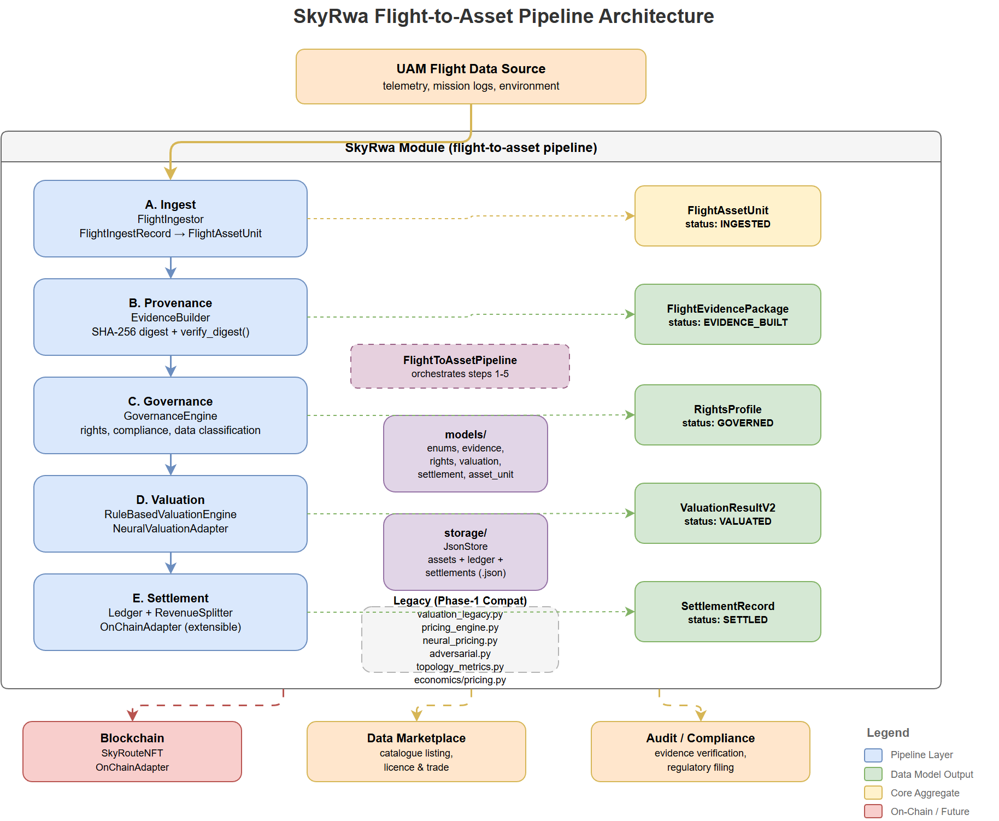

# SkyRwa — Flight-to-Asset Pipeline

> **Every UAM flight produces verifiable, governable, valuatable data-asset candidate units.**

> **Semantic Web / Knowledge Graph system artifact for ISWC 2026:**
> *From Flight Evidence to Governable Data Assets: A Knowledge Graph–Driven Flight-to-Asset Pipeline for Urban Air Mobility*

## Architecture



## Module Goal

SkyRwa transforms raw flight data into structured data-asset candidates through a five-layer pipeline:

**Ingest → Provenance → Governance → Valuation → Settlement**

It does **not** assume that every flight is automatically an asset or a token. Instead:

1. Each flight first produces a **verifiable evidence package** (attestation, not asset).
2. Governance rules determine whether the data can be shared, traded, or aggregated.
3. Only governed data products may be priced, licensed, or settled.
4. Revenue rights and on-chain registration are optional downstream steps.

## Core Concepts

### Flight Evidence vs Data Asset

| Concept | What it is | Example |
|---------|-----------|---------|
| **Flight Evidence** (`FlightEvidencePackage`) | Raw attestation record of a single flight — telemetry summary, environment context, mission result, SHA-256 digest. **Not tradable.** | "UAV-007 flew route R-03 on 2026-04-13, 4980 telemetry points, no violations" |
| **Asset Candidate** (`FlightAssetUnit`) | A governed, scored, classified wrapper around the evidence. Carries a `RightsProfile`, `ValuationResultV2`, and `SettlementRule`. **May** become tradable after governance. | The same flight, classified as `route_optimization_sample`, valued at 74.92 USD, tradable after desensitisation |
| **Governed Data Product** (`GovernedProduct`) | An aggregated data product derived from multiple asset candidates after passing full governance. Tradable and licensable. | A weather-operation dataset aggregated from 5 flights, valued at 300 USD |
| **Revenue-Right / RWA Token** | An on-chain or off-chain representation of the right to receive revenue when the asset is consumed. The `OnChainAdapter` provides a protocol-level interface. | A receipt token on Ethereum representing 50% operator share |

### Pipeline Lifecycle (Extended)

```
FlightIngestRecord
  │
  ├─ 1. ingest       → FlightAssetUnit        (status: INGESTED)
  ├─ 2. provenance   → FlightEvidencePackage   (status: EVIDENCE_BUILT)
  ├─ 3. governance   → RightsProfile           (status: GOVERNED)
  ├─ 4. valuation    → ValuationResultV2        (status: VALUATED)
  ├─ 5. settlement   → SettlementRule attached  (status: SETTLEMENT_READY)
  └─ 6. settle       → SettlementRecord         (status: SETTLED)
```

## Directory Structure

```
modules/SkyRwa/
├── __init__.py                     # Public API (backward-compat + V2 exports)
├── README.md                       # This file
│
├── models/                         # Pydantic data models
│   ├── enums.py                    # AssetClass, AssetStatus, DataCategory, UsageLevel, …
│   ├── evidence.py                 # FlightEvidencePackage, TelemetrySummary, …
│   ├── rights.py                   # RightsProfile, RetentionPolicy, RevenueParticipant
│   ├── valuation.py                # DataQualityScore, AssetValueScore, ValuationResultV2
│   ├── settlement.py               # SettlementRule, RevenueLog, SettlementRecord
│   └── asset_unit.py               # FlightAssetUnit (top-level aggregate)
│
├── ingest/                         # Layer A: flight data ingestion
│   └── flight_ingestor.py          # FlightIngestRecord → FlightAssetUnit
│
├── provenance/                     # Layer B: evidence & traceability
│   └── evidence_builder.py         # SHA-256 digest, signature stub, verify_digest()
│
├── rights/                         # Layer C: governance & data-use policies
│   └── governance.py               # GovernanceEngine
│
├── valuation/                      # Layer D: multi-dimensional valuation
│   ├── base.py                     # AbstractAssetValuationEngine
│   ├── rule_engine.py              # RuleBasedValuationEngine (default, transparent)
│   ├── neural_adapter.py           # NeuralValuationAdapter (bridges neural_pricing.py)
│   └── metrics.py                  # 8 scoring dimensions with documented rules
│
├── settlement/                     # Layer E: revenue recording & settlement
│   ├── ledger.py                   # Ledger (append-only) + SettlementRecord generation
│   ├── splitter.py                 # RevenueSplitter (config-driven, not hard-coded)
│   └── onchain_adapter.py          # OnChainAdapter ABC + NoOpOnChainAdapter
│
├── pipeline/                       # End-to-end orchestrator
│   └── flight_to_asset.py          # FlightToAssetPipeline
│
├── storage/                        # Lightweight persistence
│   └── json_store.py               # JSON file store for assets, ledger, settlements
│
├── examples/
│   └── demo_flight_to_asset.py     # Runnable 9-step demo
│
├── tests/
│   ├── conftest.py                 # Shared fixtures
│   ├── test_evidence_builder.py    # Evidence & digest tests
│   ├── test_valuation_rule_engine.py # Valuation scoring tests
│   ├── test_revenue_split.py       # Revenue split & settlement tests
│   └── test_pipeline_smoke.py      # Full pipeline smoke tests
│
│  ── Legacy files (Phase-1 compat, preserved) ──
├── valuation_legacy.py             # DataPacket, ValuationResult, AbstractValuationEngine
├── pricing_engine.py               # PricingEngine (stub, deprecated)
├── neural_pricing.py               # CyclicEmbedding, PizzaPricingModel, TorusPricingModel
├── adversarial.py                  # ArbitrageInjector
├── topology_metrics.py             # calculate_integrity_score, get_betti_numbers
└── economics/
    └── pricing.py                  # CongestionPricingModel, VoxelParams
```

## Quick Start

### Run the demo

```bash
cd SkyNetUamPlatform/modules
python -m SkyRwa.examples.demo_flight_to_asset
```

The demo walks through all 9 pipeline steps and prints detailed output at each stage.

### Run the tests

```bash
cd SkyNetUamPlatform/modules
python -m pytest SkyRwa/tests/ -v
```

### Minimal code example

```python
from datetime import UTC, datetime, timedelta
from SkyRwa.ingest.flight_ingestor import FlightIngestRecord
from SkyRwa.models.enums import UsageType
from SkyRwa.models.settlement import SettlementRule, SplitEntry
from SkyRwa.pipeline.flight_to_asset import FlightToAssetPipeline
from SkyRwa.settlement.ledger import Ledger

# 1. Prepare a flight record
record = FlightIngestRecord(
    flight_id="FLT-001",
    uav_id="UAV-01",
    mission_type="route_survey",
    start_time=datetime.now(UTC) - timedelta(hours=1),
    end_time=datetime.now(UTC),
    telemetry_points=3600,
    avg_altitude_m=100.0,
    mission_completed=True,
    raw_data_hash="sha256:abc123",
)

# 2. Configure and run pipeline
rule = SettlementRule(participants=[
    SplitEntry(party_id="platform", role="platform", share_pct=30),
    SplitEntry(party_id="operator", role="operator", share_pct=50),
    SplitEntry(party_id="processor", role="data_processor", share_pct=20),
])
pipeline = FlightToAssetPipeline(default_settlement_rule=rule)
unit = pipeline.run(record)

# 3. Simulate revenue and settle
ledger = Ledger()
ledger.record_usage(unit, UsageType.API_CALL, "consumer-A", 10.0)
settlement = ledger.settle_all(unit.asset_unit_id)

print(f"Asset: {unit.asset_unit_id}")
print(f"Value: {unit.valuation_result.estimated_value} USD")
print(f"Settled: {settlement.total_gross} USD")
```

## Valuation Rules (Transparent)

The default `RuleBasedValuationEngine` scores each asset on two axes:

### Data Quality Score (weight: 60%)

| Dimension | Weight | How it's computed |
|-----------|--------|-------------------|
| Completeness | 25% | Checks presence of telemetry points, altitude, trajectory, raw hash, mission completion |
| Temporal continuity | 20% | Telemetry point density (points/second): >= 1 Hz = 1.0, >= 0.5 Hz = 0.8, etc. |
| Sensor reliability | 20% | Starts at 1.0, penalised -0.15 per anomaly, -0.05 per alert |
| Event richness | 15% | Count of risk events + anomalies + alerts + NFZ incursions, normalised to 5 |
| Compliance degree | 20% | Governance-assigned compliance score (1.0 - violations*0.2 - anomalies*0.05) |

### Asset Value Score (weight: 40%)

| Dimension | Weight | How it's computed |
|-----------|--------|-------------------|
| Scarcity | 25% | Keyword match against rare scenarios (emergency, night, beyond_vlos, urban, weather) |
| Scenario relevance | 25% | Keyword overlap with target scenario (default: neutral 0.5) |
| Reuse potential | 30% | Composite: 0.4 * completeness + 0.3 * event_richness + 0.3 * sensor_reliability |
| Timeliness | 20% | Age-based decay: <= 1 day = 1.0, <= 7 days = 0.8, <= 30 = 0.5, <= 90 = 0.3 |

**Formula:** `estimated_value = base_price * (0.6 * quality_overall + 0.4 * value_overall)`

## Legacy File Status

| File | Status | Migration path |
|------|--------|---------------|
| `valuation_legacy.py` | **Compat layer** | `DataPacket` → `FlightIngestRecord`; `ValuationResult` → `ValuationResultV2`; `AbstractValuationEngine` → `AbstractAssetValuationEngine` |
| `pricing_engine.py` | **Deprecated stub** | Use `RuleBasedValuationEngine` instead |
| `neural_pricing.py` | **Retained** | Wrap with `NeuralValuationAdapter` for V2 pipeline |
| `adversarial.py` | **Retained** | Experimental; consider moving to `experiments/` |
| `topology_metrics.py` | **Retained** | Experimental; optional `ripser` dependency |
| `economics/pricing.py` | **Retained** | `CongestionPricingModel` is independent and stable |

## Future Integration Points

### Blockchain Registration

Implement a concrete `OnChainAdapter` subclass:

```python
from SkyRwa.settlement.onchain_adapter import OnChainAdapter

class EthereumAdapter(OnChainAdapter):
    def register_asset(self, unit): ...   # Call smart contract
    def mint_receipt(self, unit): ...     # ERC-721 or ERC-1155
    def settle_revenue(self, unit, usage_id, amount): ...
```

### Data Exchange / Marketplace

- Export `FlightAssetUnit` as a standardised catalogue entry.
- Use `RightsProfile.tradable` and `RightsProfile.desensitization_required` as listing gates.
- Feed `ValuationResultV2.estimated_value` as a suggested price.

### Audit / Compliance System

- `FlightEvidencePackage.digest_hash` provides tamper-evident attestation.
- `EvidenceBuilder.verify_digest()` enables independent audit verification.
- Export evidence as JSON for regulatory filing.

### Accounting / Asset Valuation System

- `ValuationResultV2` carries a full breakdown suitable for accounting import.
- `SettlementRecord` provides finalized revenue allocation per participant.
- `RevenueLog` entries serve as the general-ledger source of truth.

### Database Backend

Replace `JsonStore` with a SQLAlchemy / async DB adapter. The store interface
(`save`, `load`, `list_ids`, `save_ledger`, `save_settlements`) is intentionally
simple to facilitate migration.

## Semantic Web / Knowledge Graph Support

### Ontology

SkyRwa includes a formal domain ontology (`ontology/skyrwa.ttl`) defining 12 core classes and 20+ properties, aligned with PROV-O, DCAT, ODRL 2.2, and Schema.org / Dublin Core. See [`ontology/README.md`](ontology/README.md).

### RDF / JSON-LD / Turtle Export

All core domain objects can be serialized to RDF:

```python
from SkyRwa.rdf.serializer import to_turtle, to_jsonld, to_graph

ttl = to_turtle(asset_unit)        # Turtle string
jld = to_jsonld(evidence_package)  # JSON-LD string
g   = to_graph(settlement_record)  # rdflib.Graph
```

### SHACL Validation

Five SHACL shape files validate FlightEvidence, AssetCandidate, GovernedDataProduct, SettlementRule, and UsageEvent:

```python
from SkyRwa.semantic_rules import ShaclValidator
from SkyRwa.rdf.serializer import to_graph

g = to_graph(my_asset_unit)
report = ShaclValidator().validate(g)
print(report.conforms, len(report.violations))
```

### SPARQL Competency Queries

Six competency questions (CQ1–CQ6) and four analytical queries are provided as `.rq` files in `queries/`. See [`benchmarks/competency_questions.md`](benchmarks/competency_questions.md).

### Multi-flight Productization

The `productization/` layer aggregates multiple asset candidates into governed data products:

```python
from SkyRwa.productization import CandidateAggregator, ProductBuilder, ProductCatalogue

groups = CandidateAggregator(min_count=3).group(asset_units)
for cls, group in groups.items():
    product = ProductBuilder().build(group)
    ProductCatalogue().register(product)
```

### Provenance Signing (Ed25519)

Real cryptographic signatures replace the placeholder mechanism:

```python
from SkyRwa.provenance.signing import Ed25519Signer

signer = Ed25519Signer.generate_keypair("my-signer")
signer.sign_evidence(evidence_package)
assert signer.verify_evidence(evidence_package)
```

## Benchmark & Experiments

### Generate Benchmark Data

```bash
cd SkyNetUamPlatform/modules
python -m SkyRwa.benchmarks.generate_benchmark
```

Generates 30 flights across 8 scenarios with JSON inputs, RDF graphs, and expected labels.

### Run Experiments

```bash
python -m SkyRwa.experiments.eval_validation     # SHACL coverage
python -m SkyRwa.experiments.eval_queryability    # JSON vs SPARQL
python -m SkyRwa.experiments.eval_overhead        # Performance
python -m SkyRwa.experiments.eval_case_studies     # Paper case studies
python -m SkyRwa.experiments.run_queries           # All SPARQL queries
```

## Extended Directory Structure

```
modules/SkyRwa/
├── ontology/              # Domain ontology (Turtle)
│   ├── skyrwa.ttl         # Core classes & properties
│   ├── prefixes.ttl       # Shared namespace prefixes
│   ├── alignments.ttl     # PROV-O / DCAT / ODRL / Schema.org mappings
│   └── README.md
├── rdf/                   # RDF serialization layer
│   ├── namespaces.py      # Namespace declarations
│   ├── mapper.py          # Domain objects → RDF triples
│   ├── serializer.py      # to_turtle(), to_jsonld(), to_graph()
│   └── graph_store.py     # In-memory graph store + SPARQL
├── shapes/                # SHACL constraint shapes
│   ├── flight_evidence.shacl.ttl
│   ├── asset_candidate.shacl.ttl
│   ├── governed_product.shacl.ttl
│   ├── settlement_rule.shacl.ttl
│   └── revenue_record.shacl.ttl
├── queries/               # SPARQL queries
│   ├── competency/        # CQ1–CQ6 (competency questions)
│   └── analytical/        # Q1–Q4 (analytical queries)
├── semantic_rules/        # Explicit semantic governance
│   ├── validation_runner.py    # SHACL validator wrapper
│   ├── governance_rules.py     # SPARQL-based governance rules
│   ├── promotion_rules.py      # Product promotion rules
│   └── explanation_rules.py    # Structured explanation builder
├── productization/        # Multi-flight aggregation
│   ├── aggregator.py      # Group candidates by class
│   ├── product_builder.py # Build GovernedProduct
│   └── catalogue.py       # Product catalogue + RDF export
├── benchmarks/            # Evaluation data
│   ├── generate_benchmark.py   # 30-flight benchmark generator
│   ├── benchmark_spec.md
│   ├── competency_questions.md
│   ├── sample_data/       # Generated JSON inputs/labels
│   └── sample_graphs/     # Generated RDF graphs
├── experiments/           # ISWC evaluation scripts
│   ├── eval_validation.py
│   ├── eval_queryability.py
│   ├── eval_overhead.py
│   ├── eval_case_studies.py
│   └── run_queries.py
└── ISWC_DEV_NOTES.md     # Paper-to-code mapping
```

## Current Limitations

- **Scarcity metric** is keyword-based — should query a data catalogue index.
- **Scenario relevance** is keyword-based — should accept demand-side signals.
- **No real-time streaming** — the pipeline is batch/post-hoc only.
- **On-chain adapter is a no-op stub** — needs a concrete blockchain implementation.
- **No authentication/authorization** — access control is out of scope.
- **No triple store integration** — uses in-memory rdflib graph (P2 enhancement).
- **No formal ontology evaluation** (OntoClean / OOPS!) — planned for future.
